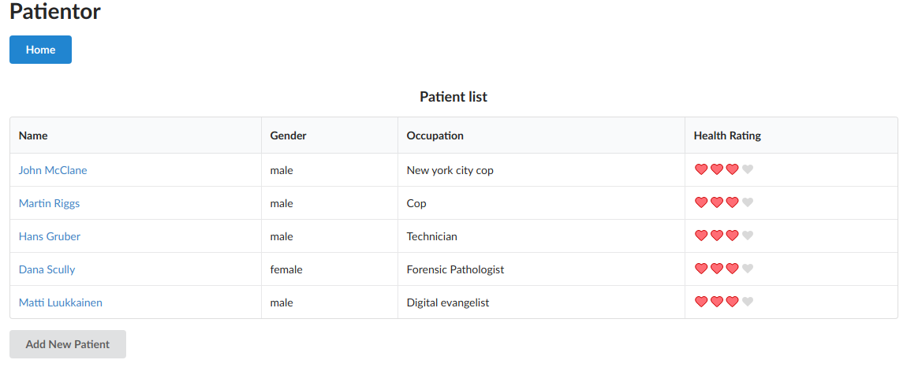
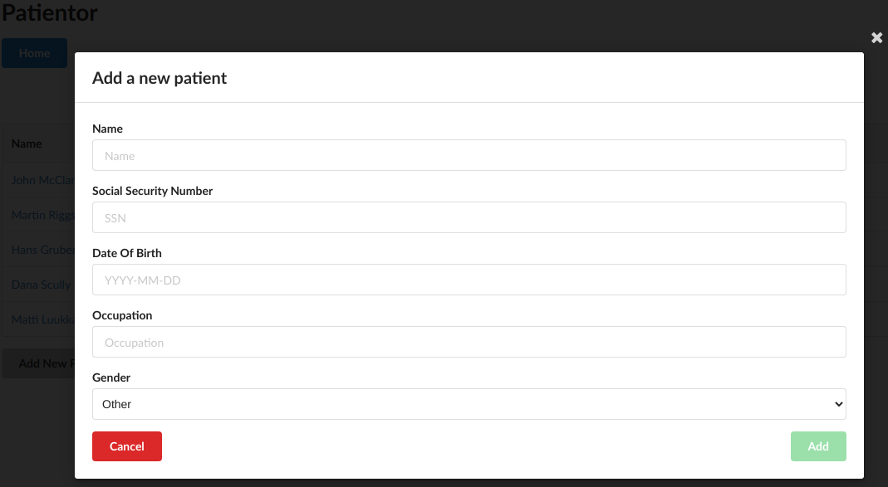
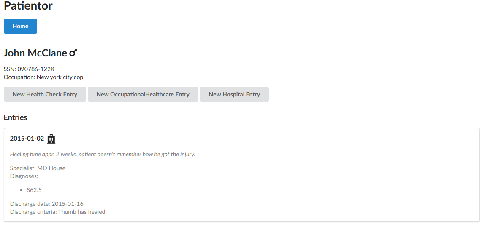
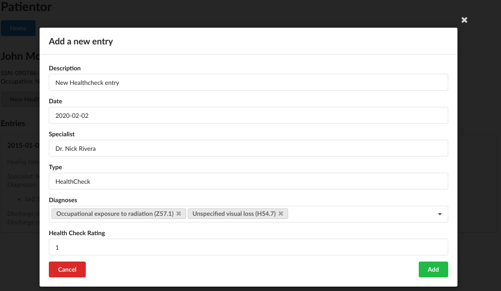
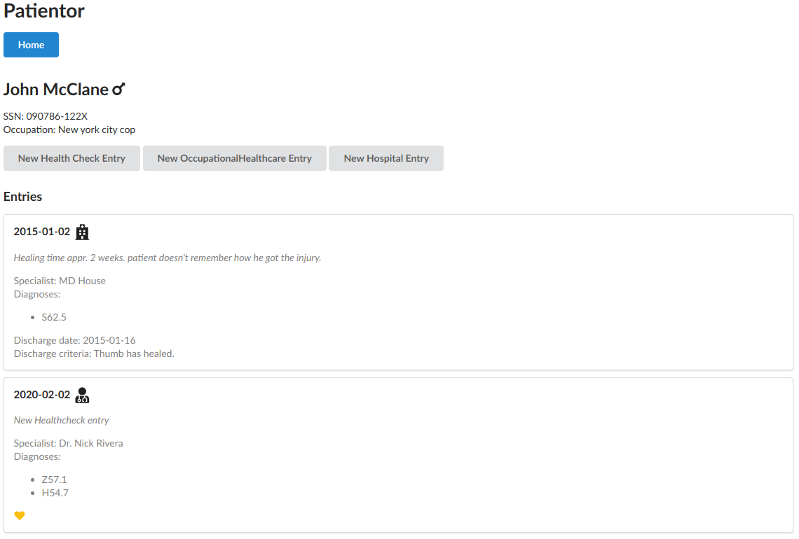

# Patientor - Frontend

The frontend for the respective [backend](https://github.com/BunnyTheLifeguard/fullstackopen2020/tree/master/Part%209/patientor-backend) of the patientor exercise using [formik](https://formik.org/) for the entry-forms.
 

### Main view:

 

 
From the main view, the user has the option to add new patients:
  

 
Clicking on a patient's name in the main view reveals more details:
  

 
Here, the user can add new entries from three categories regarding the specific patient.

Here is the form of a new Health Check Entry:
  

 
The details of the newly added entry show up right after the former entries. Along with the icons for the type of entry and the "Health Check Rating"

(1-4 => Heart color depends on rating) the details only show the codes of the diagnoses:
  

